# Исходные данные

Исходные данные можно скачать по ссылке <https://disk.yandex.ru/d/qX2hFnoL-NLUoA>

В качестве исходных данных будут использоваться:

-   границы муниципальных образований города Санкт-Петербург - *mo.geojson*;

-   плотность населения по регулярной сетке (данные от компании Kontur[^1]) - *spb_population.geojson;*

-   улично-дорожная сеть - *Улично-дорожная сеть.geojson.*

[^1]: Russian Federation population density for 400m H3 hexagons <https://data.humdata.org/dataset/kontur-population-russian-federation>

На первом этапе подготовки данных выберем ячейки плотности населения для одного из районов. Сделать это можно выделив муниципальные образования одного из районов (функция *Выбрать по значению атрибута*, атрибут *ADMIN_L5*). После этого вы можете воспользоваться функцией *Извлечь по расположению* и создать новый слой с ячейками плотности населения, попавшими внутрь выбранного района.

Слой с локациями торговых точек мы создадим самостоятельно. Для этого в строке меню необходимо выбрать *Слой* $\longrightarrow$ *Создать слой* $\longrightarrow$ *Создать слой GeoPackage*.

Далее в открывшемся окне следует указать характеристики слоя:

-   база данных - это путь к файлу, в котором будет храниться слой;

-   имя таблицы - название слоя, которое будет отображаться в панели слоев;

-   тип геометрии - нам нужны точечные объекты;

-   система координат - можно оставить географическую систему координат по умолчанию, она будет совпадать с системой координат данных, скачанных из OSM;

-   список полей, который будет включать два обязательных для нас поля - **name** (название магазина, текстовый формат данных) и **area** (площадь магазина в метрах квадратных, целое число).

{fig-align="center"}

После создания слоя, его необходимо будет сделать редактируемым и нарисовать на карте несколько точек в разных частях исследуемой территории и заполнить для них атрибутивные данные - название магазина и площадь.

::: callout-warning
Названия точек должны быть уникальными, в противном случае модель не будет работать.
:::

{fig-align="center"}

# Построение геомодели {#geomodel .section}

В этой работе мы будем оценивать вероятность посещения того или иного магазина, исходя из их доступности и площади (как прокси-метрики разнообразия ассортимента), с использованием гравитационной модели Хаффа.

$$P_{ij} = \frac{\frac{S_{j}}{T^\lambda_{ij}}}{\sum_{j}^{n}\frac{S_{j}}{T^\lambda_{ij}}}$$

-   $P_{ij}$ - вероятность того, что покупатель из локации $i$ пойдет в магазин $j$;
-   $S_{j}$ - площадь магазина $j$;
-   $T_{ij}$ - время/расстояние, которое нужно преодолеть, чтобы попасть в магазин;
-   $\lambda$ - параметр, отражающий влияние времени в пути на покупателя.

::: callout-warning
Мы воспользуемся упрощенной моделью, приняв параметр $\lambda$ равным единице, так как у нас нет подробных данных о предпочтениях покупателей.
:::

Для построения моделей будем использовать редактор моделей.

::: callout-tip
Редактор моделей позволяет выстроить последовательный процесс вычислений из цепочки операций с помощью простого графического интерфейса.

Полученная геомодель позволяет автоматизировать вычисления и избежать вывода промежуточных результатов.

Подробнее про построение геомоделей можно в [документации](https://docs.qgis.org/3.34/en/docs/user_manual/processing/modeler.html)
:::

Открыть редактор моделей можно из строки меню *Анализ данных* $\longrightarrow$ *Конструктор моделей* или по клику на кнопку *Модели* в Панели инструментов анализа.

{fig-align="center"}

В открывшемся новом окне основная часть предназначена для отображения модели в графическом виде, слева панель данных и алгоритмов (переключаются по вкладкам внизу панели), свойства и переменные модели, а также история команд.

{fig-align="center"}

## Входные данные

В первую очередь зададим для нашей модели входные данные. В нашем случае все входные данные будут представлены в виде векторных слоев:

-   плотность населения - обязательный параметр, полигоны;

-   магазины - обязательный параметр, точки;

-   улично-дорожная сеть - обязательный параметр, линии.

Обязательный параметр - это тот, без включения которого в исходные данные запуск модели осуществляться не будет.

::: callout-warning
Желательно называть входные данные буквами английского алфавита, так как иногда они могут не добавляться в модель или работать некорректно при использовании кириллицы.
:::

{fig-align="center"}

Входные данные в модели обозначаются зеленым плюсом перед названием.

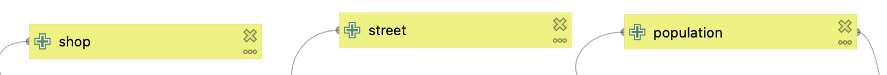

Так как все наши слои в географической системе координат для последующего расчета расстояний необходимо их перепроецировать в прямоугольную систему координат (так как данные представлены на Санкт-Петербурга, воспользуемся системой координат *EPSG: 32636 - WGS 84 / UTM zone 36N*).

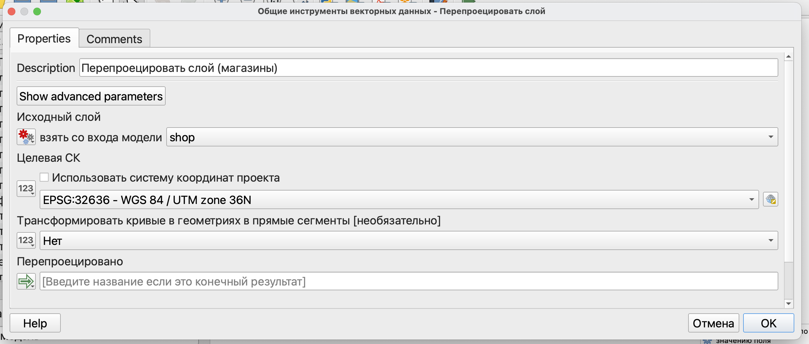

В модели появится первый шаг, соединенный с одним из входных параметров.

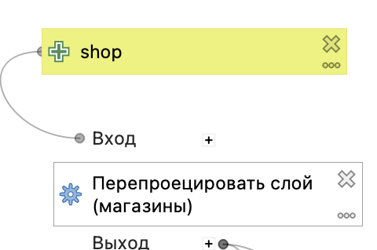{fig-align="center"}

Этот шаг нужно добавить для всех входных данных.

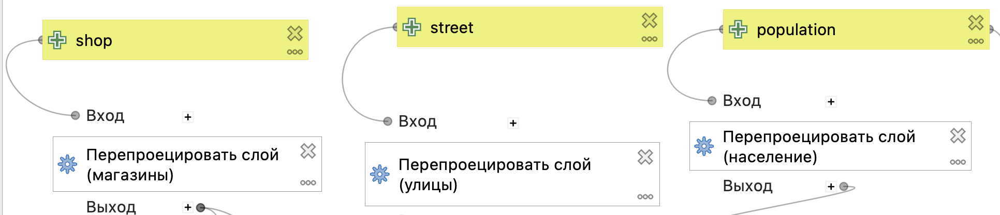{fig-align="center" width="900"}

## Расчет матрицы старт-назначение между потребителями и сервисами

Также как и для анализа размещения-распределения нам необходимо преобразовать полигональные ячейки в точечные объекты с помощью инструмента *Центроид*.

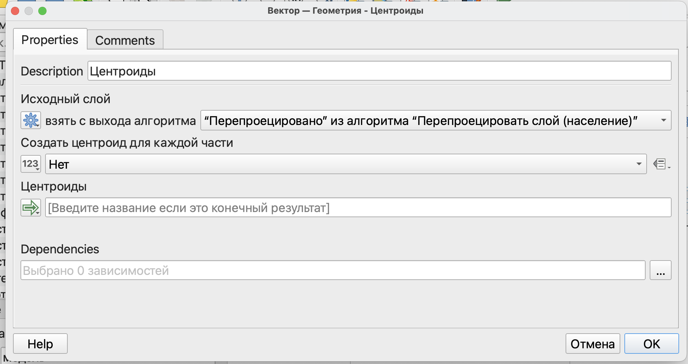{fig-align="center" width="1000"}

Для того, чтобы воспользоваться результатом, полученным на предыдущем этапе под словами *Исходный слой* нужно выбрать параметр *Вывод алгоритма*.

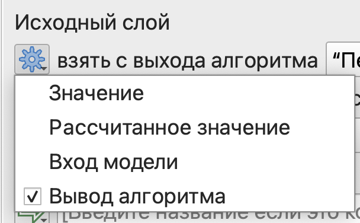{fig-align="center"}

Далее мы можем непосредственно рассчитать матрицу старт-назначение с использованием плагина QNEAT3.

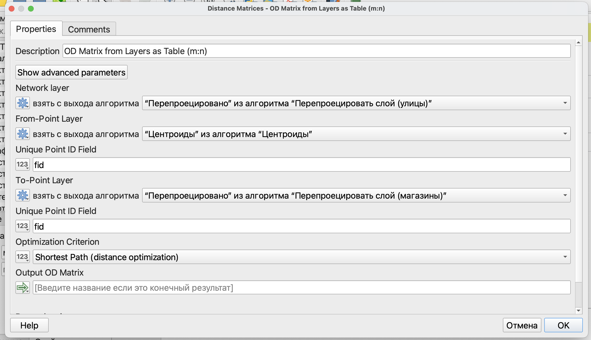

Параметры здесь указываются аналогично тому, как указывались просто в инструменте для построения матрицы.

Так как нам здесь нет необходимости впоследствии визуально отображать пути покупателей от ячеек с населением до магазинов, то строить матрицу будем просто в виде таблицы на основе двух слоев.

::: callout-warning
Идентификаторы объектов стартовых и конечных точек должны быть уникальными (внутри слоя естественно).

В нашем случае для стартовых точек (ячеек со значениями плотности населения) будет использовать *fid*, который всегда будет уникальным и есть в этом слое, а для магазинов будет использоваться поле имени *name* (поэтому нам очень важно, чтобы в этом слое названия магазинов были уникальными).
:::

Полученный результат будет представлен только в виде **таблицы без атрибутов**, которую можно присоединить к одному из векторных слоев.

Так как мы будет рассчитывать вероятность посещения того или иного магазина для каждой из ячеек, то основной расчет вероятности будет осуществляться с использованием атрибутов магазинов: название и площадь.

Присоединение будет осуществляться по совпадающим значениям полей: у исходного слоя есть *fid*, а в матрице есть *destination_id* - идентификатор стартовой точки, который был взят из *fid* исходного слоя.

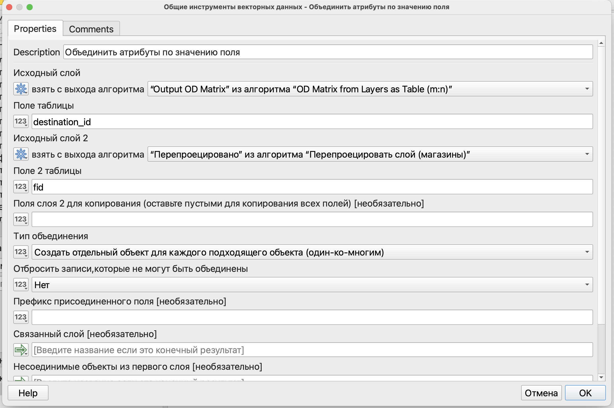

## Расчет вероятности посещения конкретного сервиса

::: callout-tip
Для того, чтобы не запутаться в однотипных операциях в одинаковыми названиями, вы можете менять его в графе *Описание* (*Description*).
:::

Следующим шагом рассчитаем вероятности, который может быть сделан в два этапа, а может быть одним.

При расчете в два этапа сначала необходимо вычислить числитель дроби $\frac{S_{j}}{T^\lambda_{ij}}$, разделив площадь каждого магазина на время в пути до него с помощью калькулятора полей. После чего рассчитать знаменатель $\sum_{j}^{n}\frac{S_{j}}{T^\lambda_{ij}}$.

Для этого необходимо фактически просуммировать все полученные нами на предыдущем шаге значения, но только для каждого жилого дома и соответствующих магазинов. То есть нам нужно просуммировать не все значения по столбцу, а только значения соответствующие одному жилому дому.

Знаменатель может быть рассчитан с использованием условия группировки в выражении.

Воспользуемся калькулятором полей и редактором выражений. Так как расчет будет осуществляться в один шаг, выражение приобретет вид:

```         
("площадь"/"total_cost")/sum("площадь"/"total_cost",group_by:="origin_id")
```

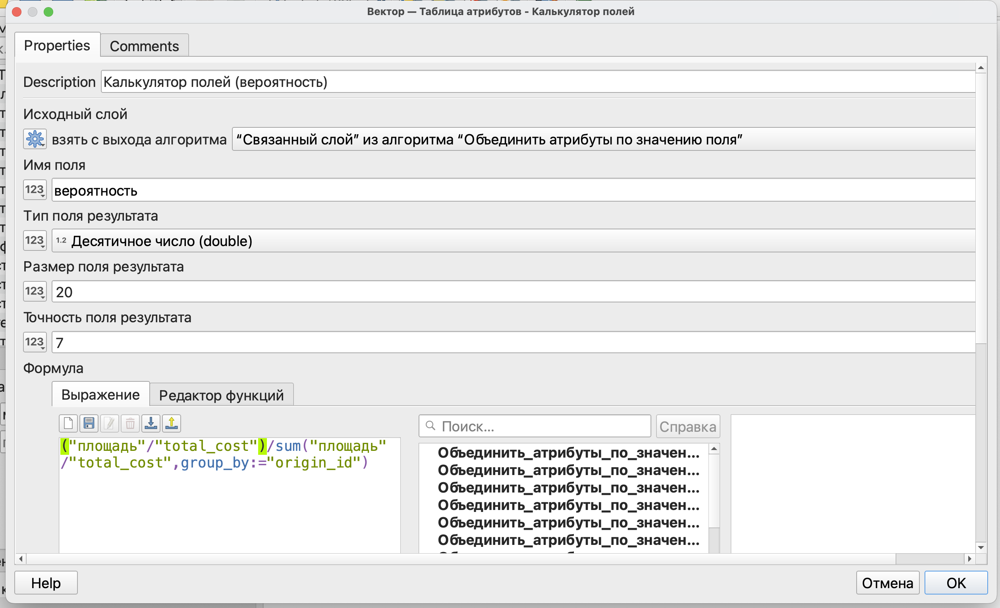

::: callout-caution
Будьте внимательны с названиями полей в калькуляторе: они должны быть написаны точно так же, как в вашей таблице атрибутов. Если они не будут совпадать, то расчет осуществлен не будет.
:::

Полученный результат можно присоединить в качестве атрибутов к ячейкам плотности населения, чтобы рассчитать количество потенциальных покупателей и показать его на карте.

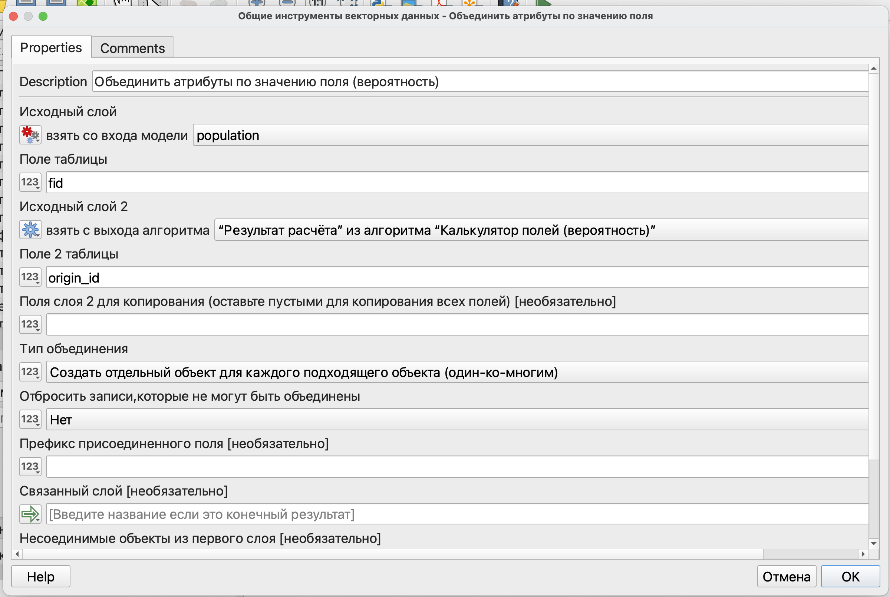{fig-align="center" width="1000"}

Само же число покупателей может быть рассчитано по формуле: $$
E_{ij} = P_{ij}C_{i}
$$

где $E_{ij}$ - предполагаемое количество покупателей из локации $i$, которые пойдут в магазин $j$;

$P_{ij}$ - вероятность того, что покупатель из локации $i$ пойдет в магазин $j$;

$C_{i}$ - количество покупателей в локации $i$.

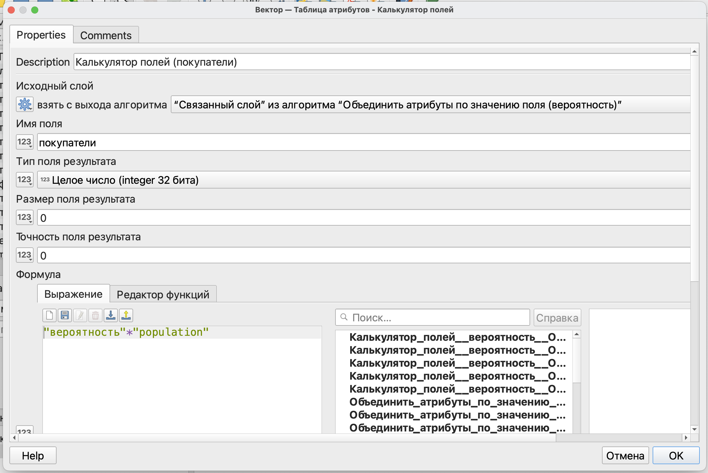

Полученная схема модели показана на рисунке ниже.

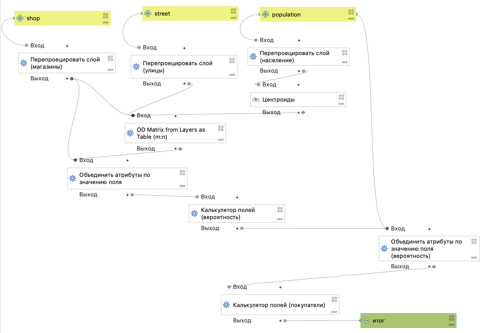{fig-align="center" width="1000"}

Перед запуском модель можно проверить командой из строки меню *Модель* $\longrightarrow$ *Проверить модель*.

Запуск модели осуществляется либо по кнопке {width="21"}, либо из строки меню *Модель* $\longrightarrow$ *Запустить модель.*

После запуска модель выглядит практически как стандартный инструмент из Панели инструментов анализа.

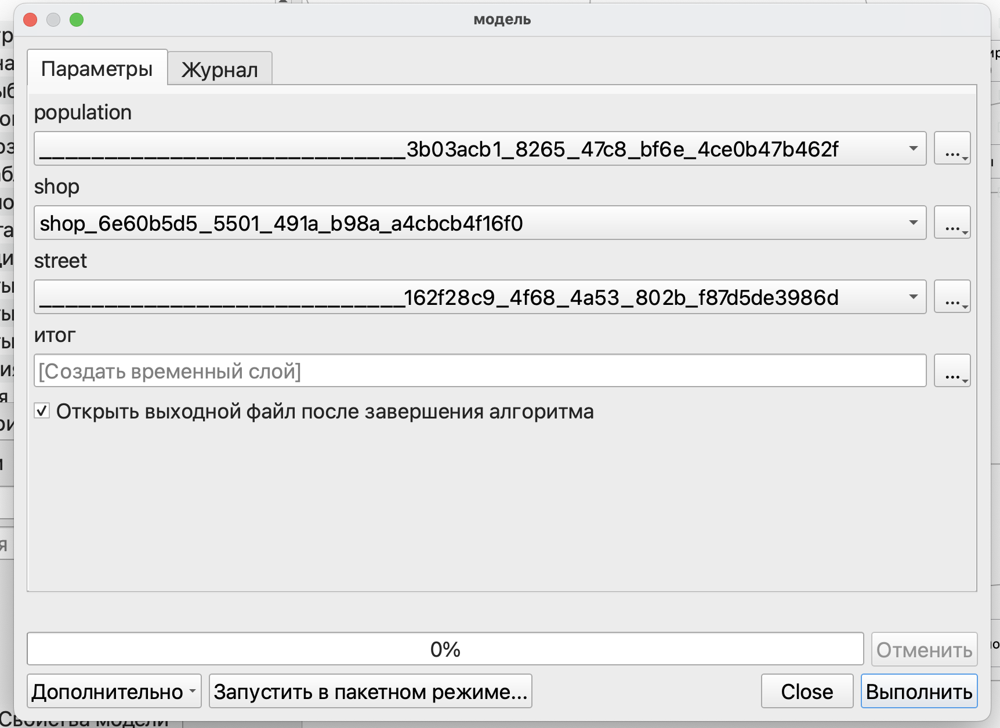{fig-align="center" width="900"}

Полученная в итоге таблица атрибутов позволяет увидеть повторяемость каждого из зданий (обратите внимание, что в колонке *origin_id* значения повторяются столько раз, сколько у вас было магазинов в примере):

-   *origin_id* - идентификатор дома из исходных данных;

-   *destination_id* - идентификатор (название) магазина из исходных данных;

-   *total_cost* - расстояние от конкретного дома до магазина из матрицы старт-назначение;

-   *area* - площадь магазина из исходных данных;

-   *area_time -* отношение площади магазина к расстоянию, рассчитанное на промежуточном этапе;

-   *summa -* сумма всех предыдущих значение для каждого дома;

-   *probability* - вероятность посещения конкретного магазина жителями этого дома.

::: callout-tip
Проверить корректность своих расчетов можно проверив два условия:

-   вероятность (последняя колонка может находиться только в пределах от нуля до единицы);

-   сумма вероятностей для каждого дома должна равняться единице.
:::

::: callout-tip
В качестве финального этапа можем разделить полученный в итоге слой так, чтобы для каждого из магазинов был свой отдельный слой.

Для этого воспользуемся инструментом *Разбить векторный слой* и разобьем его на отдельные слои по идентификаторам магазинов.

{fig-align="center"}

Здесь результат тоже будет выводиться как конечный.

Таким образом, по результату запуска модели будет выводиться слой, содержащий вероятности по всем домам и магазинам, и слои, содержащие вероятности по отдельным магазинам (этих слоев будет столько, сколько было магазинов в исходном слое).

Окно запуска модели немного изменится: в нем появится возможность выбора папки для сохранения наших результатов разделения слоя.
:::

Полученная модель может быть сохранена как отдельный файл в формате *.model3* (*Модель* $\longrightarrow$ *Сохранить модель как*) или как часть проекта (*Модель* $\longrightarrow$ *Сохранить модель в проекте).*

{fig-align="center"}
